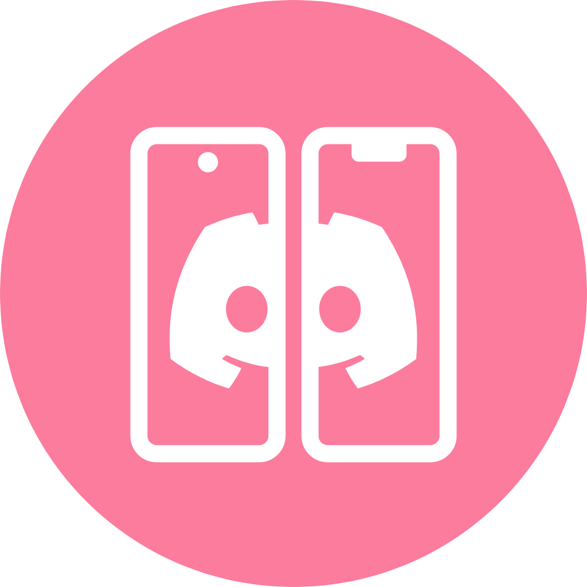
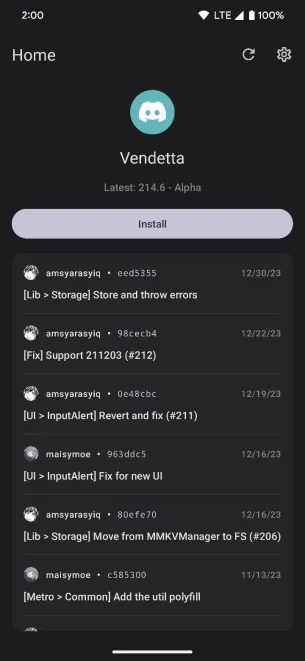

  

# Discord Mod Manager

Easily install Discord Mods on Android

  <!--  -->
  
---

  <!--  

  
  
  
  
   
  
  
  &color=blue)
  &color=blue)
  

   

   -->

Build
---

#### Prerequisites

- [Git](https://git-scm.com/downloads)
- [JDK 17](https://www.oracle.com/java/technologies/javase/jdk11-archive-downloads.html)
- [Android SDK](https://developer.android.com/studio)

#### Instructions

1. Clone the repo
    - `git clone https://github.com/SelfMadeSystem/DiscordModManager.git && cd DiscordModManager`
2. Build the project
    - Linux: `chmod +x ./gradlew && gradlew assembleDebug`
    - Windows: `./gradlew assembleDebug`
3. Install on device
    - [Enable usb debugging](https://developer.android.com/studio/debug/dev-options) and plug in
      your phone
    - Run `adb install app/build/outputs/apk/debug/app-debug.apk`

## Contributing

This is an open-source project, you can do so without any programming.

Here are a few things you can do:

- [Test and report issues](https://github.com/SelfMadeSystem/DiscordModManager/issues/new/choose)

<!-- - [Translate the app into your language](https://crowdin.com/project/vendetta-manager) -->

License
---
DMM is licensed under the Open Software License version 3.0

